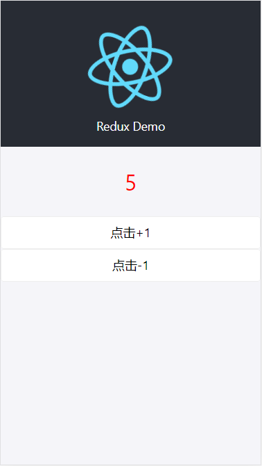
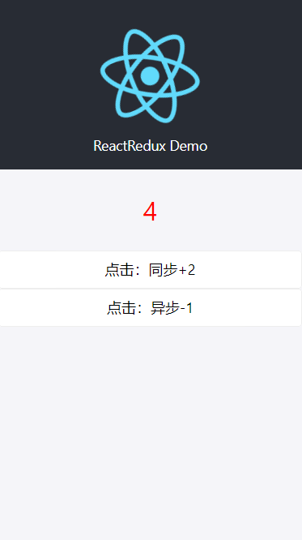
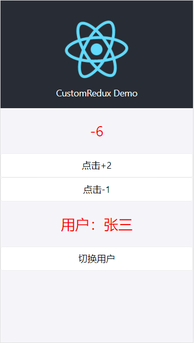

# React Redux不完全指南
当初刚入职时即被要求开发react应用，作为"vue工程师"的本人，碍于公司安排花了一两周撸了一两遍react官网，达到勉强能写的程度。相信朋友们在学习react及相关周边的时候，最让人脑壳疼的莫过于redux了，这TMD到底什么玩意儿啊，为啥vuex我能很快上手，但是redux看不懂啊，有么有？一度怀疑自己智商，但是转头一想，除了多看几遍多写几遍，还能怎样呢？

闲话少说，今天索性简单介绍下Redux的简单使用，不BB，开整！

### redux的三大原则
- 单一数据源
>整个应用的 state 被储存在一棵 object tree 中，并且这个 object tree 只存在于唯一一个 store 中。
- State 是只读的
> 唯一改变 state 的方法就是触发 action，action 是一个用于描述已发生事件的普通对象。
- 使用纯函数来执行修改
> 为了描述 action 如何改变 state tree ，你需要编写 reducers，根据不同的action，返回新的state

### redux的单向数据流


### redux的基本使用
```js
1. 安装依赖
# NPM
npm install redux
# Yarn
yarn add redux

2. 创建store
// store/store.js
import { createStore } from 'redux'
import counterReducer from './reducer'
let store = createStore(counterReducer)

export default store

3. 创建reducer纯函数
// store/reducer.js
function counterReducer (state = 0, action) {
  switch (action.type) {
    case 'INCREMENT':
      return state + 1
    case 'DECREMENT':
      return state - 1
    default:
      return state
  }
}

export default counterReducer

// 创建action
// store/actions.js
export function increment () {
  return { type: 'INCREMENT' }
}

export function decrement () {
  return { type: 'DECREMENT' }
}

//redux store的消费：ReduxDemo组件
import React, { useState, useEffect } from 'react'
import logo from './logo.svg';
import * as css from './App.module.scss';
import { Button } from 'antd-mobile';

import store from './store/store'
import { increment, decrement } from './store/actions'

function ReduxDemo () {
  const [count, setCount] = useState(0)
  useEffect(() => {
    // 设置count初始值
    setCount(store.getState())
    // 订阅store的变化，并在组件销毁时取消订阅
    const unsubscribe = store.subscribe(() => setCount(store.getState()))
    return () => {
      unsubscribe()
    }
  }, [])

  return (
    <div className={css.App}>
      <header className={css['App-header']}>
        
        Redux Demo
      </header>
      <p className={css.count}>
        {count}
      </p>
      // dispacth 一个action，如{ type: 'DECREMENT' }，还可以传值喔，
      // 如{ type: 'DECREMENT', payload: 10}
      <Button onClick={() => store.dispatch(increment())}>点击+1</Button>
      <Button onClick={() => store.dispatch(decrement())}>点击-1</Button>
    </div>
  );
}

export default ReduxDemo;

```



666，运行正常！

如果action里面是一个异步操作怎么办呢？毕竟在action里进行ajax请求之类的操作，不是挺常见的么。
好，那么我们开始对decrement进行改造：
```js
export function decrement () {
  // return { type: 'DECREMENT' }
  setTimeout(() => {
    return { type: 'DECREMENT' }
  })
}
```

很不幸的是，点击-1后抛出错误`Error: Actions must be plain objects. Use custom middleware for async actions.`，这是因为redux只支持同步操作，如果要进行异步操作，还得需要redux-chunk之类的中间件
```js
export function decrement () {
  // return { type: 'DECREMENT' }
  // setTimeout(() => {
  //   return { type: 'DECREMENT' }
  // })
  return dispatch => {
    setTimeout(() => {
      dispatch({
        type: 'DECREMENT',
      })
    }, 1000)
  }
}
```

ok，一切正常，完美。

在组件中使用redux还得自己手动订阅store的变化，并且需要记得在组件卸载后移除订阅，麻烦！社区里为了使redux能够更好的和react协作，推出了react-redux解决方案，现在我们来简单演示下使用。

### react-redux的基本使用
```js
// 这里不再赘述相关npm包的安装
1. 在根组件上包裹Provider
// index.js
import React from 'react';
import ReactDOM from 'react-dom';
import './index.css';
import ReduxDemo from './ReduxDemo';
import ReactReduxDemo from './ReactReduxDemo';
// <Provider store> 使组件层级中的 connect() 方法都能够获得 Redux store。 
// 正常情况下，根组件应该嵌套在 <Provider>中才能使用 connect() 方法。
import { Provider } from "react-redux"
import store from './reactReduxStore/store'

ReactDOM.render(
  <React.StrictMode>
    {/* <ReduxDemo /> */}
    <Provider store={store}>
      <ReactReduxDemo />
    </Provider>
  </React.StrictMode>,
  document.getElementById('root')
);

2. 创建store
// reactReduxStore/store.js
import { createStore, applyMiddleware } from 'redux'
import counterReducer from './reducer'
// redux-thunk支持异步
import thunk from 'redux-thunk'
let store = createStore(counterReducer, applyMiddleware(thunk))

export default store

// 创建reducer纯函数
// reactReduxStore/reducer.js
function counterReducer (state = 0, action) {
  switch (action.type) {
    case 'INCREMENT':
      // action携带参数
      return state + action.payload
    case 'DECREMENT':
      return state - 1
    default:
      return state
  }
}
export default counterReducer

3. 创建actions
// reactReduxStore/actions.js
export function increment (payload) {
  // action携带参数
  return { type: 'INCREMENT', payload }
}

export function decrement () {
  // 异步
  return dispatch => {
    setTimeout(() => {
      dispatch({
        type: 'DECREMENT',
      })
    }, 1000)
  }
}

4. redux store的消费：ReactReduxDemo组件
// ReactReduxDemo.js
import React, { useState, useEffect } from 'react'
import logo from './logo.svg';
import * as css from './App.module.scss';
import { Button } from 'antd-mobile';
import { connect } from 'react-redux' // 将组件与redux连接起来
import * as counterActions from './reactReduxStore/actions'
import { bindActionCreators } from 'redux' // 合并多个actions

function ReactReduxDemo (props) {
  const { counterActions: { increment, decrement }, count } = props
  return (
    <div className={css.App}>
      <header className={css['App-header']}>
        
        ReactRedux Demo
      </header>
      <p className={css.count}>
        {count}
      </p>
      <Button onClick={() => increment(2)}>点击：同步+2</Button>
      <Button onClick={() => decrement()}>点击：异步-1</Button>
    </div>
  );
}
// 将state合入组件的props中
const mapStateToProps = (state) => {
  return {
    count: state
  }
}
// action 较少时的写法
// const mapDispatchToProps = (dispatch) => {
//   return {
//     increment: () => { dispatch(increment()) },
//     decrement: () => { dispatch(decrement()) }
//   }
// }

// action较多时的写法
// 将dispatch合入props中
const mapDispatchToProps = (dispatch) => {
  return {
    counterActions: bindActionCreators(counterActions, dispatch)
  }
}

// mapStateToProps, mapDispatchToProps先后顺序不能颠倒
// connect 利用高阶组件，将state及dispatch合入组件中
export default connect(mapStateToProps, mapDispatchToProps)(ReactReduxDemo)
```
运行正常，很好！



从相关实现看起来，还是有点麻烦的，那么如果我们不想要引入react-redux怎么办呢？很庆幸的是，我们可以根据context 及 useReducer，自己实现类似redux的功能。

### context及useReducer实现redux功能
在实现过程中发现了一个比较尴尬的问题，那就是"action里不能进行异步"（在未使用异步解决方案的前提下）操作问题又暴露了处理，该如何解决呢？

其实仔细想来也不难，既然dispatch只能处理同步任务，那就满足它不就行了？那么如何满足呢？在执行相关操作时，把dispach作为参数传入，action.js相关方法中再执行同步操作不就好了，虽然方案比较丑陋，但是黑猫、白猫，能逮到老鼠不就得了！
```js
// 创建CustomContext
// customRedux/context.js
import React from 'react'
const CustomContext = React.createContext();

export default CustomContext

// 创建actions
// customRedux/actions.js
export function increment (dispatch, payload) {
  // action携带参数
  dispatch({ type: 'INCREMENT', payload })
}

export function decrement (dispatch) {
  // 异步
  setTimeout(() => {
    dispatch({ type: 'DECREMENT' })
  }, 1000)
}

export function toggleUser (dispatch) {
  dispatch({ type: 'TOGGLE_USER' })
}
// 创建reducer
// customRedux/reducer.js
// reducer必须是纯函数
export const initalState = { count: 0, user: '张三' }
function rootReducer (state = initalState, action) {
  console.log(action);
  switch (action.type) {
    case 'INCREMENT':
      // action携带参数
      return { ...state, count: state.count + action.payload }
    case 'DECREMENT':
      return { ...state, count: state.count - 1 }
    case 'TOGGLE_USER':
      return { ...state, user: state.user === '张三' ? '李四' : '张三' }
    default:
      return state
  }
}

export default rootReducer

// useReducer，useContext
import React, { useContext, useReducer } from 'react'
import logo from './logo.svg';
import * as css from './App.module.scss';
import { Button } from 'antd-mobile';

import { increment, decrement, toggleUser } from './customRedux/actions'
import CustomContext from './customRedux/context'
import rootReducer, { initalState } from "./customRedux/reducer"

function CustomReduxWrapper () {
  const [state, dispatch] = useReducer(rootReducer, initalState);
  return (
    <CustomContext.Provider value={[state, dispatch]}>
      <CustomRedux />
    </CustomContext.Provider>
  )
}

function CustomRedux (props) {
  const [state, dispatch] = useContext(CustomContext)
  return (
    <div className={css.App}>
      <header className={css['App-header']}>
        
        CustomRedux Demo
      </header>
      <p className={css.count}>{state.count}</p>
      <Button onClick={() => increment(dispatch, 2)}>点击+2</Button>
      <Button onClick={() => decrement(dispatch)}>点击-1</Button>
      <p className={css.user}>用户：{state.user}</p>
      <Button onClick={() => toggleUser(dispatch)}>切换用户</Button>
    </div >
  );
}

export default CustomReduxWrapper;

```


至此，我们已经见到了redux、react-redux的基本使用方法，并通过context及useReducer实现了类似redux的功能，如果对你的学习有些许帮忙，帮忙点个赞吧！