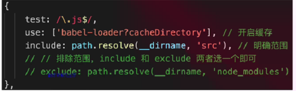
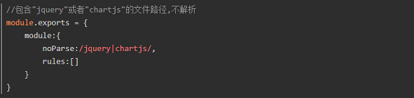
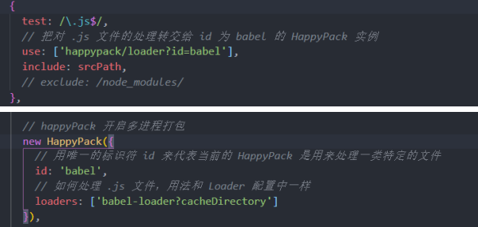
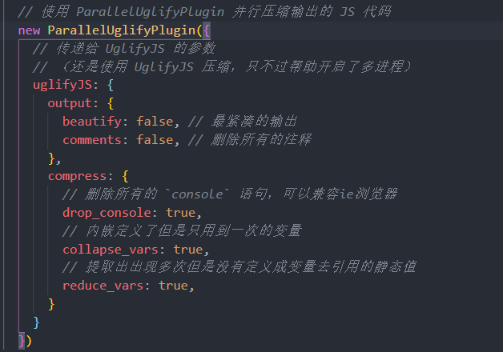
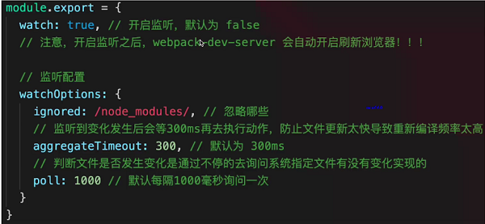
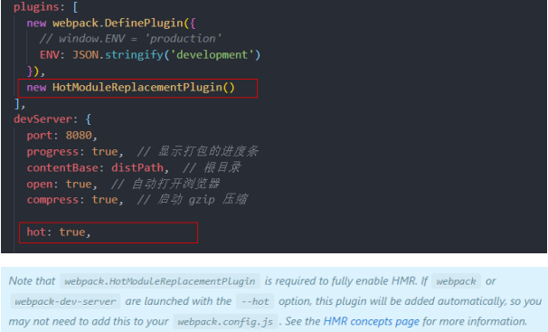
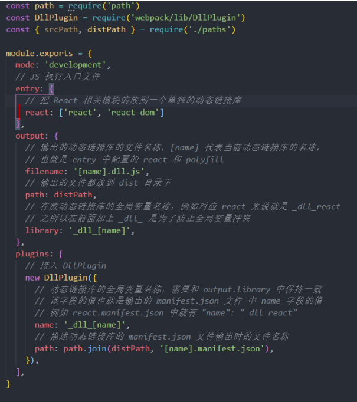
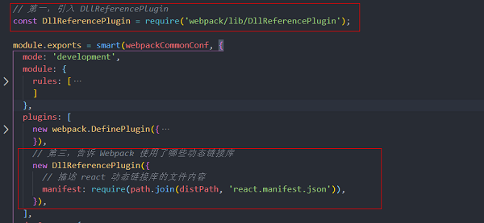
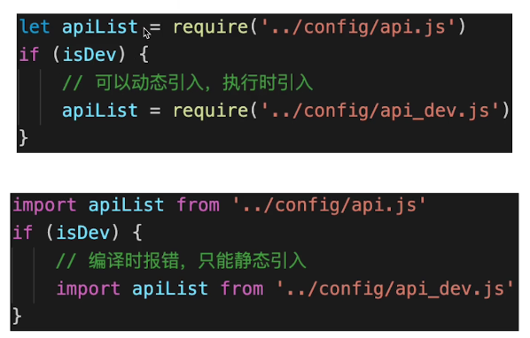

# 前端工程之性能优化
如今前端发展日益繁荣，项目工程越来越复杂，项目越来越庞大！随着应用的日益庞大复杂，性能优化已然成为一个重要的研究课题，那么今天我将从自己的技术栈出发，结合日常总结、项目实践及相关资料，总结工作中常见的优化手段。

#### 首先，我们要搞清楚在网址栏输入url到渲染出页面的整个过程
- 加载资源的形式
  - html代码
  - 媒体文件，如图片，音视频资源等
  - js、css文件
- 加载过程
  - DNS解析：域名->IP地址（可能不同区域解析出不同的IP地址）
  - 浏览器根据IP地址向浏览器发起http请求
  - 服务器处理http请求，并返回给浏览器
- 渲染过程
  - 根据HTML代码生成DOM Tree
  - 根据css代码生成CSSOM
  - 将DOM Tree和CSSOM整合成Render Tree
  - 根据Render Tree渲染页面
  - 遇到script标签则暂停渲染，优先加载并执行js代码，完成再继续（共用同一线程）
  - 直至把Render Tree渲染完成

#### 然后根据渲染过程，确定优化方向
- 让加载更快
  - 减少资源体积：如压缩代码、分割代码、服务使用Gzip压缩
  - 减少访问次数，合并代码，ssr服务端渲染，缓存
  - 使用更快的网络：CDN加速
- 让渲染更快
  - css 放在head中，js放在body最下面
  - 如需尽早开始执行js，用DOMContentLoaded触发
  - 懒加载（图片懒加载、上滑加载更多等）
  - 对DOM查询进行缓存，比如for循环中
  - 频繁DOM操作，合并到一起插入DOM结构
  - 节流throttle防抖debounce

#### 再然后，结合当前火热的vue、react前端框架及webpack构建工具，实施具体的优化措施
##### Vue常见的性能优化
1. 合理使用v-show/v-if  
2. 合理使用computed  
3. v-for时加key，避免和v-if同时使用如果需要使用v-for给每项元素绑定事件时使用事件代理  
4. 自定义事件、DOM事件及时销毁（避免内存泄漏）  
5. 使用路由懒加载、异步组件  
6. 合理使用keep-alive   
7. 第三方模块按需引入  
8. 长列表滚动到可视区域动态加载  
9.  data层级不要太深（深度监听需要一次性遍历完成，造成遍历过多） 
10. 使用vue-loader 在开发环境做模板编译 vue-runtime 版本  
11. webpack层面（具体参考下文）  
12. 前端通用性能优化，如图片懒加载  
    减少HTTP请求/减小cookie大小/将样式表放到页面顶部/将脚本放到页面底部/将javascript和css从外部引入/压缩javascript和css/服务使用Gzip压缩/防抖节流

##### React 性能优化
1. 渲染列表使用key
2. 自定义事件、定时器、DOM事件等及时销毁
3. 合理使用异步组件
4. 减少函数bind this的次数（每次render都会进行一次bind操作消耗性能）
5. 合理使用SCU、PureComponent和memo
6. webpack层面（具体参考下文）
7. 前端通用的性能优化，如图片懒加载  
   减少HTTP请求/减小cookie大小/将样式表放到页面顶部/将脚本放到页面底部/将javascript和css从外部引入/压缩javascript和css/服务使用Gzip压缩/防抖节流


#### webpack性能优化

- 优化打包构建速度---开发体验和效率  
- 优化产出代码---产品性能  

##### 1）优化打包构建速度
###### 1：优化babel-loader
- 开启缓存，未修改过的es6+代码，就不会重新编译  
- 限定打包范围 include or exclude(exclude优先级高于前者)



###### 2：IgnorePlugin
忽略第三方包指定目录，让这些指定目录不要被打包进去


```js
new webpack.IgnorePlugin({
  resourceRegExp: /^\.\/locale$/,
  contextRegExp: /moment$/,
});
```
moment这个库中，如果引用了./locale/目录的内容，就忽略掉，不会打包进去

###### 3：noParse
用了noParse的模块将不会被loaders解析，所以当我们使用的库如果太大，并且其中不包含import、require、define的调用，我们就可以使用这项配置来提升性能， 让 Webpack 忽略对部分没采用模块化的文件的递归解析处理。



###### 4：happyPack（多进程打包）
多进程打包，提高构建速度（特别是多核CPU）



###### 5：ParallelUglifyPlugin（多进程压缩js，常用于生产环境）
webpack内置Uglify工具压缩js（单进程）

项目较大，打包较慢时，开启多进程能提高速度  
项目较小，打包很快，开启多进程可能会降低速度（进程开销）  
所以，按需使用



###### 6：自动刷新（开发环境）
启动webpack-dev-server会自动开启该功能



###### 7：热更新（开发环境）
模块热更新是webpack的一个功能，它可以使得代码修改之后，不用刷新浏览器就可以更新。在应用过程中替换添加删除模块，无需重新加载整个页面，是高级版的自动刷新浏览器。  

优点：  
只更新变更内容，以节省宝贵的开发时间。调整样式更加快速，几乎相当于在浏览器中更改样式  



###### 8：DllPlugin 动态链接库插件（开发环境）
前端框架如vue React，体积大，构建慢  
较稳定，不常升级  
同一版本只构建一次即可，不用每次都重新构建  

webpack 已经内置DllPlugin支持  
DllPlugin---打包出dll文件（类似于第三方库）  
DllReferencePlugin---使用dll文件  





再将react.dll.js文件引入html模板中即可（切勿忘记）

##### 9：缩小文件的搜索范围(配置include exclude alias noParse extensions)
alias: 当我们代码中出现 import 'vue'时， webpack会采用向上递归搜索的方式去node_modules 目录下找。为了减少搜索范围我们可以直接告诉webpack去哪个路径下查找。也就是别名(alias)的配置。  
include exclude 同样。配置include exclude也可以减少webpack loader的搜索转换时间。  
extensions：webpack会根据extensions定义的后缀查找文件(频率较高的文件类型优先写在前面) 

##### 10：尽量使用高版本的webpack 和node
webpack4 发布时，官方也曾表示，其编译速度提升了 60% ~ 98%。  

##### 2）优化产出代码（比构建速度更重要）
- 体积更小  
- 合理分包，不重复加载  
- 速度更快，内存使用更小（代码执行更快）  

###### 1：小图片base64编码 (配合url-loader limit配置项)
###### 2：bundle加hash （使用contentHash，只有文件变更后才加载新内容）
###### 3：懒加载 import()
###### 4：提取公共代码(splitChunksPlugin)
###### 5：IngorePlugin （忽略第三方包指定目录，让这些指定目录不要被打包进去）
###### 6：使用CDN加速（通过配置publicPath）
CDN的全称是(Content Delivery Network)，即内容分发网络。其目的是通过在现有的Internet中增加一层新的CACHE(缓存)层，将网站的内容发布到最接近用户的网络”边缘“的节点，使用户可以就近取得所需的内容，提高用户访问网站的响应速度。从技术上全面解决由于网络带宽小、用户访问量大、网点分布不均等原因，提高用户访问网站的响应速度。
简单的说，CDN的工作原理就是将您源站的资源缓存到位于全球各地的CDN节点上，用户请求资源时，就近返回节点上缓存的资源，而不需要每个用户的请求都回您的源站获取，避免网络拥塞、缓解源站压力，保证用户访问资源的速度和体验  
###### 7：使用production模式
自动开启代码压缩、Vue/React等会自动删掉调试代码（如开发环境的warning），自动启动tree-shaking  

为了学会使用 tree shaking，你必须:  
- 使用 ES2015 模块语法（即 import 和 export）
- 在项目 package.json 文件中，添加一个 "sideEffects" 入口(注意，任何导入的文件都会受到 tree shaking 的影响。这意味着，如果在项目中使用类似 css-loader 并导入 CSS 文件，则需要将其添加到 side effect 列表中，以免在生产模式中无意中将它删除)
- 引入一个能够删除未引用代码(dead code)的压缩工具(minifier)
```js
// 开启 tree shaking
 optimization: {
   usedExports: true,
 },
```
备注：ES6 Module和Commonjs区别  
- ES6 Module是静态引入，编译时引入，Commonjs是动态引入，执行时引入，所以只有ES6 - Module才能静态分析，实现Tree-Shaking



###### 8：Scope Hoisting
- 代码体积更小  
- 创建函数作用域更少  
- 代码可读性更好  
- Scope Hoisting 它可以让webpack打包出来的代码文件更小，运行更快，它可以被称作为 "作用域提升"。
[Scope Hoisting](https://blog.csdn.net/qq_36380426/article/details/107298332)


